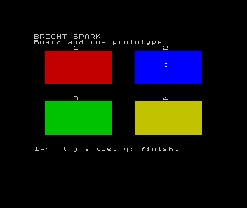

# Bright Spark: board and cue prototype

This is a prototype for the agreed replacement sequence, not a new published lesson or the complete memory game. It retains the older samples in their existing paths.

## Target and checkpoints

Stock 48K ZX Spectrum, Sinclair BASIC, 50 Hz display configuration. The verification runner uses the released Apple silicon Emu198x Spectrum v0.22.1 and a configured, lawfully supplied 48K ROM.

- `steps/step-01.bas`: one red rectangle, with its digit printed above it.
- `steps/step-02.bas`: four panels, each with one persistent digit. A drawing routine selects the panel's coordinates, colours and note.
- `steps/step-04.bas`: a later-stage test driver for fixed `"22"` playback, held-q exit and release hand-off. It reads one subsequent key without judging it; it is not the player-response game.
- `steps/step-03.bas`: press 1–4 to try the associated cue. Brightness and an asterisk indicate activation; q ends the program. Release one key before pressing another. No sequence is stored or judged yet.

Start with an empty program. The steps are complete listings; they do not depend on a menu, engine or earlier program in memory. The later lesson-writing pass will explain their changes through smaller runnable stages where necessary.

The digits sit outside the rows repainted by the renderer. This preserves identity during drawing as well as at its endpoints. Green/yellow panels use black cue ink; red/blue use white. The active asterisk supplies a shape change alongside brightness. The captured blue cue has been visually inspected in colour. Wider readability review, including monochrome and different displays, remains open.



The cue pitches are 0, 4, 7 and 12 semitones above middle C, each lasting 0.15 seconds. These are original choices for this prototype, not a claim to reproduce another game's sound. `BEEP` occupies the program while sounding. The renderer also takes time; the whole cue lasts longer than the note alone.

## Routine contract

`GO SUB 500` reads `p` (1–4) and `lit` (0 or 1). It fills the chosen rectangle and, when lit, draws an asterisk. It sets shared scratch variables `pr`, `pc`, `colour`, `inkcol`, `note` and the rendering loop variable `r`. It leaves PAPER 0, INK 7 and BRIGHT 0 selected. It does not change `p`, `lit` or `k$`.

`GO SUB 900` lights the selected panel, sounds its note, restores its resting appearance and pauses before returning. It leaves `lit=0`. Its `PAUSE 10` is interruptible by a key; this is a deliberate point to investigate before designing automatic sequence playback, not a fixed-duration scheduling guarantee.

The key loop captures once into `k$`, returns empty readings directly to capture, validates before choosing `p`, and waits for release after a cue or irrelevant key. It accepts no new input while a cue runs. The later memory game must explain what happens to taps made during that interval.

## Verification

From this directory:

```sh
python3 verification/verify.py --emulator /path/to/emu198x-spectrum --output /tmp/bright-spark-checks
```

Requires Python 3 and the sibling Meet BASIC opening verification transport. BASIC is entered through actual ROM key chords over MCP, including BRIGHT. No tokenised-program injection or memory patches are used. The runner checks labels on every sampled cue frame, captures each active state, checks repeat/irrelevant/held input outcomes, records four tones, investigates PAUSE separately, and saves then loads the ordinary prototype in a fresh process.

Generated screenshots, WAVs and `spark.tap` are review artefacts. The TAP is a BASIC program tape, not an emulator snapshot. Load the tape in Emu198x and enter `LOAD "spark"`, start playback and wait for the load report, then `RUN`. Host Keyboard uses left Option/Alt for SYMBOL SHIFT and Shift+left Option/Alt for extended mode.

Results must distinguish frame observations and measured signals from native keyboard feel, listening and original-hardware behaviour. No website page or game catalogue status changes as part of this prototype.

### Recorded findings — 6 September 2026

[Execution evidence](verification/results/execution.json) records the three checkpoints, four panel cues, consecutive identical cues, input outcomes, quit and fresh-process save/load. [Audio input checks](verification/results/input-audio.json) distinguish one held press (one sustained note) from release and a second press (two). [Pitch measurements](verification/results/pitches.json) find the four expected pitches within 25 Hz using short-window crossing counts. These are captured emulator signals, not a listening assessment.

The initial short PAUSE probe has unequal key-call durations and should not be used as a precise timing comparison. The [separate controlled probe](verification/results/pause.json) runs `PAUSE 50` with equal elapsed-frame accounting: completion is observed at 56 frames without interruption and 12 with a key pressed after ten frames. These totals include BASIC execution and printing. This confirms interruption in this configuration; it does not measure the cue routine's exact duration.

This behaviour is documented in *ZX Spectrum BASIC Programming*, second edition (1983), chapter 18, “Motion”, p. 129. Chapters 16 (“Colours”) and 19 (“BEEP”) describe the other relevant BASIC facilities. No emulator blocker was identified in these checks. Automatic playback still needs a deliberate timing policy and key-interference checks before lesson publication.

Run the supplementary checks after the main runner:

```sh
python3 verification/input_audio.py --emulator /path/to/emu198x-spectrum --tape /tmp/bright-spark-checks/spark.tap --output /tmp/bright-spark-input
python3 verification/pitches.py /tmp/bright-spark-checks/four-cues.wav --output /tmp/bright-spark-checks/pitches.json
python3 verification/pause.py --emulator /path/to/emu198x-spectrum --output /tmp/bright-spark-pause
```

The committed active preview comes from the supplementary fresh-tape run. Capture waits for a second consecutive active screen-memory observation so the displayed frame has time to include the asterisk. The main evidence's label checks are screen-memory observations, not a claim that every raster frame was visually inspected.

## Playback policy

For the opening implementation, allow `PAUSE 10` to be shortened by a key. Keep the complete note and resting repaint; do not claim a fixed frame deadline. This follows the approved brief's permitted-interruption option and needs reconsideration if the renderer, target or note lengths change.

[Playback checks](verification/results/playback-playback.json) exercised fixed `314`, `22` and `1234`, plus `22` with no input, two-frame tapping, a held 2 and held q. The active marker disappeared between the repeated cues for 26 sampled frames without interference and 18 under tapping/holding (0.52 and 0.36 seconds at 50 Hz). These are screen-memory observations, not measurements of a fully repainted raster. [Audio windows](verification/results/playback-audio-separation.json) show two distinct sustained tones with approximately 0.54 seconds between their detected windows under interference. No listening judgement is implied.

Holding q from the first active marker exited after 22 observed frames (about 0.44 seconds), after that cue completed. The prototype checks q between cues: a short tap entirely inside a cue may be missed. Instructions therefore say **hold q to finish** during WATCH. The held playback key must be released before YOUR TURN accepts a fresh key; the checks confirmed that 2 did not become a response and a subsequent 3 was read. The test driver does not yet validate or judge responses.

```sh
python3 verification/playback.py --emulator /path/to/emu198x-spectrum --output /tmp/bright-spark-playback
python3 verification/audio_separation.py /tmp/bright-spark-playback
python3 verification/pitches.py /tmp/bright-spark-playback/1234-none.wav --output /tmp/bright-spark-playback/pitches.json
```

The original runner still checks steps 1–3. The separate playback runner owns step 4 and deliberately replaces its sequence with fixed test strings. The approved full game's response comparison, growth, score, replay and ending remain to build.
